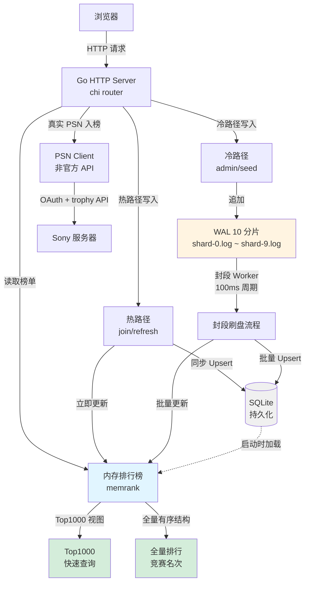
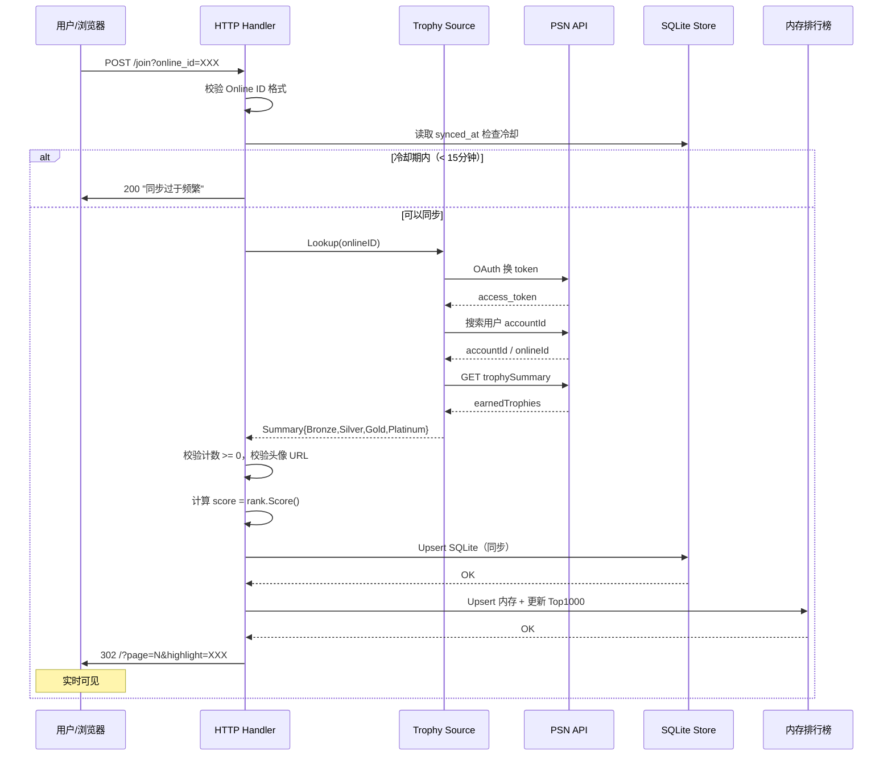
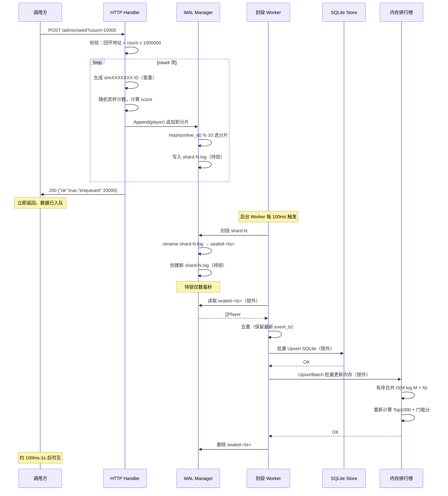
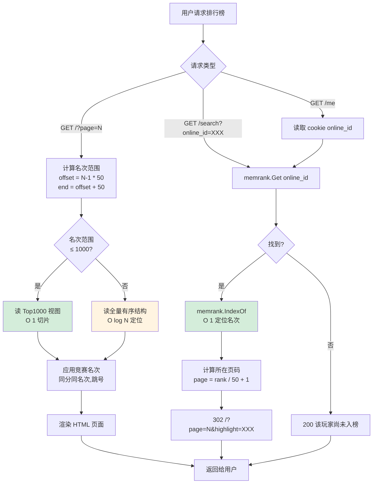
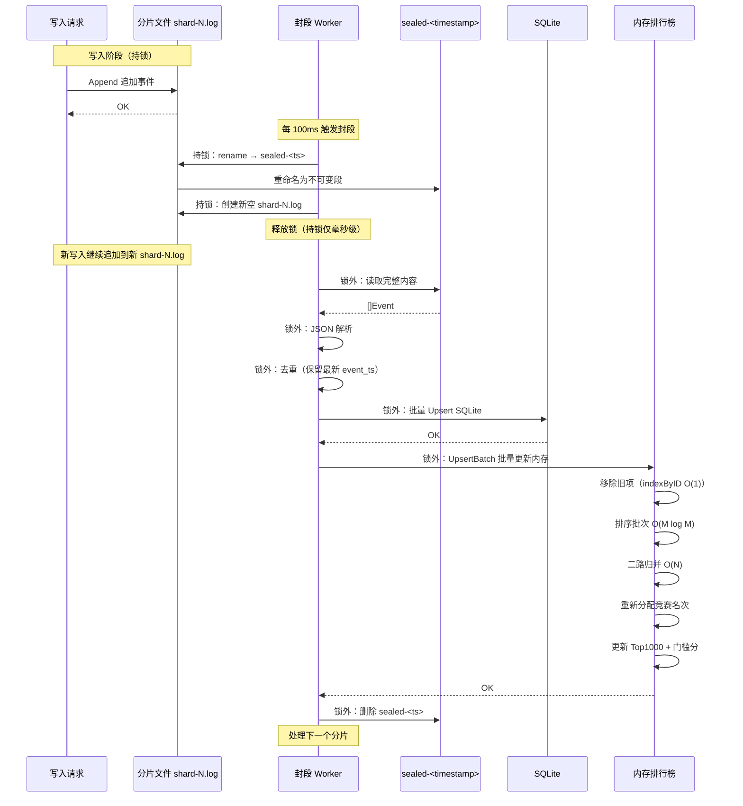

# 架构文档

本文档详细说明 PSN 奖杯排行榜的系统架构，包括高吞吐写入演进架构（Phase 1+2 已落地）。

---

## 1. 系统总览

当前 main 实现了高吞吐写入演进架构 Phase 1+2 及排序优化（PR #11–#16，2026-09-11）。



**核心组件**：
- **HTTP Server**：chi 路由器，处理 `/join`、`/refresh`、`/admin/seed`、`GET /` 等端点
- **内存排行榜（memrank）**：全量玩家数据 + Top1000 视图；门槛分；线程安全
- **WAL（Write-Ahead Log）**：10 个 hash 分片文件，封段刷盘协议，支持大批量灌数
- **SQLite**：持久化存储，启动时加载到内存；热路径同步写入，冷路径批量 Upsert
- **PSN Client**：调用 Sony 非官方 API，拉取真实玩家奖杯汇总

---

## 2. 写入路径：热路径 vs 冷路径

系统根据请求来源采用不同的写入路径：
- **热路径**：真实 PSN 入榜/刷新（`/join` `/refresh`），同步写入 SQLite + 实时内存更新
- **冷路径**：模拟数据灌入（`/admin/seed`），追加到 WAL，异步批量刷盘（可见延迟 ≤1s）

### 2.1 热路径写入流程（/join, /refresh）



**关键特点**：
- **同步写入**：Upsert SQLite 成功后立即更新内存
- **实时可见**：302 跳转时，数据已在排行榜可查询
- **冷却保护**：15 分钟内禁止重复同步，保护上游 PSN API
- **门槛判断**：当前始终走热路径（未来可根据分数与门槛分判断）

---

### 2.2 冷路径写入流程（/admin/seed）



**关键特点**：
- **异步写入**：HTTP 请求立即返回 `enqueued`，实际写入由后台 Worker 完成
- **WAL 分片**：10 个文件，按 `online_id` hash 分片，降低锁竞争
- **封段刷盘**：每 100ms 触发，rename 为 sealed 后在锁外慢速处理
- **锁优化**：持锁仅 rename + 创建新文件（毫秒级），读取/解析/DB upsert/内存更新全在锁外
- **批量更新**：`UpsertBatch` 一次性更新内存，避免逐条触发全量排序
- **可见延迟**：≤1 秒（封段周期对齐）
- **硬顶限制**：单次最多 100 万条

---

## 3. 读取路径：Top1000 视图 vs 全量内存

所有读取请求（`GET /`、`/search`、`/me`）从内存完成，**稳态读不访问 SQLite**。



**关键特点**：
- **Top1000 优化**：常见查询（前 20 页）只读 Top1000 视图，O(1) 切片
- **全量回退**：1000 名之后走全量有序结构，O(log N) 二分查找定位
- **O(1) 查找**：`indexByID map[string]int` 实现常数时间玩家定位（PR #16 优化 B）
- **竞赛名次**：同分同名次，随后跳号（例：1、1、3）
- **无 SQL 查询**：稳态读完全在内存完成，不访问 SQLite

---

## 4. WAL 封段刷盘时序

封段协议确保崩溃恢复简单、数据不丢失（≤1s 窗口）。



**关键设计**：
1. **Rename 封段**：原子操作，避免「备份再截断」的数据窗口问题
2. **持锁最小化**：仅 rename + 创建新文件在锁内（文件系统操作，毫秒级）
3. **锁外慢速操作**：读取、JSON 解析、去重、批量 DB upsert、内存更新全在锁外
4. **有序合并**：UpsertBatch 使用二路归并，复杂度 O(M log M + N)（PR #16 优化 B）
5. **崩溃恢复**：启动时重放所有 `sealed-*` 文件（幂等），禁止「先删 WAL 再写库」
6. **去重策略**：同一 `online_id` 保留 `event_ts` 最新的事件

---

## 5. 性能优化总结

### 5.1 排序优化（PR #16）

**优化 A：标准库排序**
- `internal/rank.SortAndNumber` 使用 `slices.SortFunc`
- O(N²) 插入排序 → O(N log N) 标准库排序
- pprof 显示插入排序原占 ~77% CPU，优化后显著降低

**优化 B：有序合并**
- `internal/memrank.UpsertBatch` 使用二路归并
- 复杂度从 O(M * N log N) 优化为 O(M log M + N)（批量 M，总量 N）
- WAL flush count=10000 时，从 N 次全量重排优化为 1 次批量合并

**优化 C：O(1) 查找**
- 新增 `indexByID map[string]int` 维护玩家下标索引
- `Get` 和 `IndexOf` 从 O(N) 线性扫描降为 O(1) map 查找

### 5.2 WAL 锁优化（PR #14）

**问题**：seed count=1万时，封段 flush 长时间持锁，阻塞新写入，卡数秒

**修复**：
- 拆分 `sealAndFlush` 为 `sealShard`（持锁）和后续处理（锁外）
- 持锁范围：仅 rename + 创建新文件（毫秒级）
- 锁外操作：读 sealed 段、JSON 解析、去重、批量 DB upsert、内存更新

**效果**：seed count=1万也能秒级返回 `enqueued` 状态

### 5.3 批量内存更新（PR #15）

**问题**：WAL flush 时每个玩家都调用 `UpsertMemory`，触发 N 次全量排序

**修复**：
- 新增 `UpsertMemoryBatch` 方法，批量写入玩家到内存 map，**只 rebuild 一次**
- ReplaySealed / StartSealing 改用批量更新

**效果**：N 个玩家只触发 1 次排序，而非 N 次

---

## 6. 配置参数

| 环境变量 | 默认值 | 说明 |
|---------|--------|------|
| `PSN_NPSSO` | 空 | Sony NPSSO cookie（`/join` 端点必需） |
| `DB_PATH` | `./data/leaderboard.db` | SQLite 数据库文件路径 |
| `LISTEN_ADDR` | `127.0.0.1:8080` | HTTP 监听地址（pprof 与 seed 共用） |
| `WAL_DIR` | `./data/wal/` | WAL 文件目录 |
| `WAL_SEAL_INTERVAL_MS` | `100` | 封段周期（毫秒），与可见延迟对齐 |

---

## 7. 可观测性

### 7.1 pprof 监控（PR #14）

- **访问路径**：`http://127.0.0.1:8080/debug/pprof/`
- **用法示例**：
  ```bash
  # CPU profile（采样 30 秒）
  curl http://127.0.0.1:8080/debug/pprof/profile?seconds=30 > cpu.prof
  go tool pprof -http=:6060 cpu.prof
  
  # Heap profile
  curl http://127.0.0.1:8080/debug/pprof/heap > heap.prof
  go tool pprof -http=:6060 heap.prof
  
  # Goroutine 堆栈
  curl http://127.0.0.1:8080/debug/pprof/goroutine?debug=1
  ```
- **安全**：仅本机访问（与主服务共用 `LISTEN_ADDR`），生产环境切勿绑定公网

### 7.2 日志（PR #14）

- **日志库**：使用 Go 标准库 `log/slog`（结构化日志）
- **输出**：默认 `TextHandler` 输出到 `stderr`
- **关键事件**：
  - 启动与初始化（加载玩家数量、内存排行榜门槛分）
  - WAL 封段与刷盘（批次大小、耗时）
  - PSN API 调用失败（不记录敏感凭证）
  - 错误与异常（含上下文字段）
- **安全**：**禁止**将 `PSN_NPSSO`、access token 等敏感凭证打印到日志

---

## 8. 未来演进方向

### 8.1 Prometheus Metrics（Phase 3）

- 写入 QPS（热路径 / 冷路径分开统计）
- WAL 状态（每片 sealed 积压数量、目录总大小）
- 刷盘性能（耗时 P50/P99、批次大小）
- Top1000 门槛分变化
- 热路径 SQLite upsert 耗时
- 内存重建耗时

### 8.2 热路径 micro-batch（Phase 4，可选）

**场景**：若观测到热路径（`/join` `/refresh`）仍有冲击，可增加 10ms 窗口聚合

**实现**：
- 热路径写入先追加到短时缓冲（10ms）
- 缓冲满或超时后，批量 Upsert SQLite + 批量更新内存
- 保持用户感知「提交后立即可见」

**收益**：热路径 QPS 进一步提升

### 8.3 双路径门槛判断（当前简化）

**当前行为**：
- `/join` `/refresh` 始终走热路径（同步 SQLite + 内存）
- `/admin/seed` 始终走冷路径（WAL 追加）

**未来可选**：
- 根据新分数与门槛分判断：`score > 门槛分` → 热路径；否则 → 冷路径
- 保证高分冲榜玩家实时可见，低分玩家异步批量

---

## 9. 相关文档

- **产品需求**：`tasks/prd-psn-trophy-leaderboard.md`
- **技术方案**：`tasks/spec-psn-trophy-leaderboard.md`（第 13 节详细设计）
- **提交历史**：`提交历史说明.md`（PR #1–#16）
- **README**：项目根目录 `README.md`
- **PSN 调用链流程图**：`docs/flowchart.html`

---

*最后更新：2026-09-11（对齐 main commit 572781a）*
